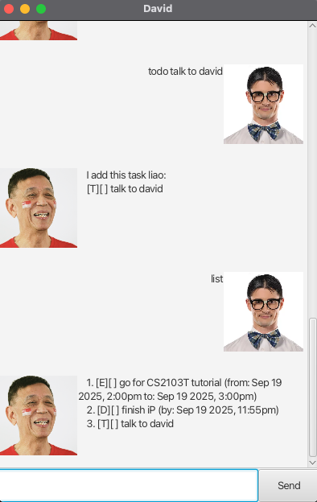

# David User Guide




David is your friendly Singlish uncle that can keep track of your tasks for you!

## Features
* Type commands to run actions
* Follow the given command formats exactly!

### Adding Todos

Add a task which has to be completed without a specified date.

Format: `todo [task description]`

Example: `todo finish README`

```
I add this task liao:
[T][] finish README
```

## Adding Deadlines

Add a task which has to be completed by a deadline.

* Follow the date and time formats exactly

Format: `deadline [task description] \by [date in yyyy-mm-dd] [time in 24 hour format]`

Example: `deadline release JAR \by 2025-09-19 2359`

```
I add this task liao:
[D][] release JAR (by: Sep 19 2025, 11:59pm) 
```

## Adding Events

Add a task with a start and end date and time.

* Follow the date and time formats exactly

Format: `event [task description] \from [date in yyyy-mm-dd] [time in 24 hour format] \to [date in yyyy-mm-dd] [time in 24 hour format]`

Example: `event go for CS2103T tutorial \from 2025-09-19 1400 \to 2025-09-19 1500`

```
I add this task liao:
[E][] go for CS2103T tutorial (from: Sep 19 2025, 2:00pm to Sep 19 2025, 3:00pm)
```

## View Task List

View all current tasks.

Format: `list`

Example: `list`

```
1. [T][] finish README
2. [D][] release JAR (by: Sep 19 2025, 11:59pm)
3. [E][] go for CS2103T tutorial (from: Sep 19 2025, 2:00pm to Sep 19 2025, 3:00pm)
```
## Mark Task

Marks a task as done.

* Marks the task at the specified index
* Index must be a number shown in the task list
* Only mark tasks that are not marked yet

Format: `Mark [task number]`

Example: `Mark 1`

```
I mark this task as done liao:
[T][X] finish README
```

## Delete Task

Deletes a task.

* Deletes the task at the specified index
* Index must be a number shown in the task list
* Task numbers in the task list will update accordingly

Format: `delete [task number]`

Example: `delete 1`

```
I this task kenna delete liao:
[T][X] finish README

// typing delete 1 again will delete the release JAR task now
```

## Undo Command

Undo the previous command if it is undoable.

* Undoable commands: delete, mark, todo, deadline, event

Format: `undo`

Example: `undo`

```
Ok I undo the latest command liao

// assuming this if after the previous delete 1, task list will look like the original again
```

## Search Task

Search for a task using a keyword.
* Exact string matching is used (Case and space sensitive)

Format: `find [keyword]`

Example: `find JAR`

```
Eh here is your matching tasks ok, I took very long to find:
1. [D][] release JAR (by: Sep 19 2025, 11:59pm)
```

## Exit Chatbot

Exit and close chatbot.

Format: `bye`

Example: `bye`

```
// Chatbot window closes
```